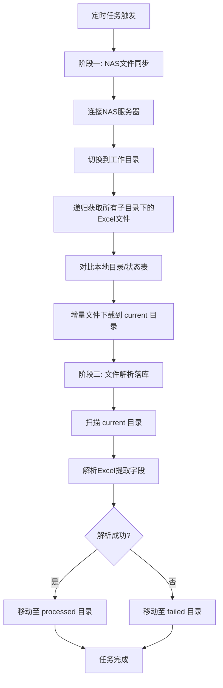

# NAS文件同步设计方案

**基于FTP协议连接NAS服务器。**

## 流程步骤

通过定时任务按照一定的频率去执行NAS文件同步+文件解析落库 

1、NAS文件同步实现逻辑；

 连接NAS服务器-》切换到工作目录=》递归获取所有子目录下的所有Excel文件=》对比NAS文件状态表，对增量的Excel文件下载至current目录。

 2、文件解析落库实现逻辑； 

对current目录的Excel文件进行解析，提取字段进行落库，解析成功则移动至processed目录，否则移动到failed目录。




## 数据库设计

NAS文件状态表SQL

```sql
-- =====================================================
-- 表名: nas_file_sync_state
-- 描述: NAS文件同步状态表
-- =====================================================
CREATE TABLE nas_file_sync_state (
    -- ===== 主键 =====
    id BIGSERIAL PRIMARY KEY,
    
    -- ===== 文件标识（唯一） =====
    remote_path VARCHAR(500) NOT NULL,
    file_name VARCHAR(200) NOT NULL,
    file_extension VARCHAR(10),
    
    -- ===== 文件元数据 =====
    file_size BIGINT DEFAULT 0,
    last_modified_time BIGINT,
    
    -- ===== 目录结构（便于业务查询） =====
    eqp_id VARCHAR(50),
    wafer_id VARCHAR(50),
    time_dir VARCHAR(50),
    parent_path VARCHAR(500),
    
    -- ===== 同步状态 =====
    sync_status VARCHAR(20) DEFAULT 'PENDING',
    sync_time TIMESTAMP,
    
    -- ===== 解析状态 =====
    parse_status VARCHAR(20) DEFAULT 'PENDING',
    parse_time TIMESTAMP,
    parse_retry_count INTEGER DEFAULT 0,
    parse_error_msg VARCHAR(500),
    
    -- ===== 本地路径 =====
    local_path VARCHAR(500),
    current_location VARCHAR(20) DEFAULT 'CURRENT',
    
    -- ===== 审计字段 =====
    create_time TIMESTAMP DEFAULT CURRENT_TIMESTAMP,
    update_time TIMESTAMP DEFAULT CURRENT_TIMESTAMP,
);

-- =====================================================
-- 索引
-- =====================================================
CREATE INDEX idx_sync_status ON nas_file_sync_state (sync_status);
CREATE INDEX idx_parse_status ON nas_file_sync_state (parse_status);
CREATE INDEX idx_current_location ON nas_file_sync_state (current_location);
CREATE INDEX idx_parse_retry_count ON nas_file_sync_state (parse_retry_count);
CREATE INDEX idx_eqp_wafer ON nas_file_sync_state (eqp_id, wafer_id);
CREATE INDEX idx_time_dir ON nas_file_sync_state (time_dir);
CREATE INDEX idx_create_time ON nas_file_sync_state (create_time);

-- =====================================================
-- 表注释
-- =====================================================
COMMENT ON TABLE nas_file_sync_state IS 'NAS文件同步状态表';
COMMENT ON COLUMN nas_file_sync_state.remote_path IS '远程文件完整路径（唯一标识）';
COMMENT ON COLUMN nas_file_sync_state.file_name IS '文件名';
COMMENT ON COLUMN nas_file_sync_state.file_extension IS '文件扩展名（xlsx/xls/csv）';
COMMENT ON COLUMN nas_file_sync_state.file_size IS '文件大小（字节）';
COMMENT ON COLUMN nas_file_sync_state.last_modified_time IS '远程文件最后修改时间戳';
COMMENT ON COLUMN nas_file_sync_state.eqp_id IS '设备ID（从路径提取）';
COMMENT ON COLUMN nas_file_sync_state.wafer_id IS '晶圆ID（从路径提取）';
COMMENT ON COLUMN nas_file_sync_state.time_dir IS '时间目录（从路径提取）';
COMMENT ON COLUMN nas_file_sync_state.parent_path IS '父目录路径';
COMMENT ON COLUMN nas_file_sync_state.sync_status IS '同步状态: PENDING-待同步, SYNCED-已同步';
COMMENT ON COLUMN nas_file_sync_state.sync_time IS '同步完成时间';
COMMENT ON COLUMN nas_file_sync_state.parse_status IS '解析状态: PENDING-待解析, SUCCESS-解析成功, FAILED-解析失败';
COMMENT ON COLUMN nas_file_sync_state.parse_time IS '解析时间（最后一次解析时间）';
COMMENT ON COLUMN nas_file_sync_state.parse_retry_count IS '解析重试次数';
COMMENT ON COLUMN nas_file_sync_state.parse_error_msg IS '解析错误信息（最后一次错误）';
COMMENT ON COLUMN nas_file_sync_state.local_path IS '本地文件路径';
COMMENT ON COLUMN nas_file_sync_state.current_location IS '文件位置: CURRENT-待处理, PROCESSED-已处理, FAILED-失败待重试, FINAL_FAILED-最终失败';
COMMENT ON COLUMN nas_file_sync_state.create_time IS '创建时间（首次发现文件的时间）';
COMMENT ON COLUMN nas_file_sync_state.update_time IS '最后更新时间';
```


## 代码实现

### 目录结构

```
src/main/java/com/yourproject/
├── enums/
│   ├── SyncStatusEnum.java
│   ├── ParseStatusEnum.java
│   └── CurrentLocationEnum.java
├── entity/
│   └── NasFileSyncState.java
├── mapper/
│   └── NasFileSyncStateMapper.java
├── service/
│   ├── NasFtpService.java
│   ├── NasSyncService.java
│   ├── ExcelParseService.java
│   └── NasRetryService.java
├── handler/
│   └── NasSyncAndParseProcessor.java
├── retry/
│   └── NasRetryProcessor.java
└── monitor/
    └── NasMonitorProcessor.java
```

### Maven依赖
pom.xml
```xml
<dependency>
    <groupId>commons-net</groupId>
    <artifactId>commons-net</artifactId>
    <version>3.11.0</version>
</dependency>
```

### 枚举类
SyncStatusEnum.java

```java
package com.yourproject.enums;

import lombok.AllArgsConstructor;
import lombok.Getter;

/**
 * 同步状态枚举
 */
@Getter
@AllArgsConstructor
public enum SyncStatusEnum {

    PENDING("PENDING", "待同步"),
    SYNCED("SYNCED", "已同步");

    private final String code;
    private final String desc;

    public static SyncStatusEnum fromCode(String code) {
        for (SyncStatusEnum status : values()) {
            if (status.getCode().equals(code)) {
                return status;
            }
        }
        return null;
    }

    public boolean isPending() {
        return this == PENDING;
    }

    public boolean isSynced() {
        return this == SYNCED;
    }
}
```

ParseStatusEnum.java

```java
package com.yourproject.enums;

import lombok.AllArgsConstructor;
import lombok.Getter;

/**
 * 解析状态枚举
 */
@Getter
@AllArgsConstructor
public enum ParseStatusEnum {

    PENDING("PENDING", "待解析"),
    SUCCESS("SUCCESS", "解析成功"),
    FAILED("FAILED", "解析失败");

    private final String code;
    private final String desc;

    public static ParseStatusEnum fromCode(String code) {
        for (ParseStatusEnum status : values()) {
            if (status.getCode().equals(code)) {
                return status;
            }
        }
        return null;
    }

    public boolean isPending() {
        return this == PENDING;
    }

    public boolean isSuccess() {
        return this == SUCCESS;
    }

    public boolean isFailed() {
        return this == FAILED;
    }

    public boolean isFinished() {
        return this == SUCCESS || this == FAILED;
    }
}
```

CurrentLocationEnum.java

```java
package com.yourproject.enums;

import lombok.AllArgsConstructor;
import lombok.Getter;

/**
 * 文件位置枚举
 */
@Getter
@AllArgsConstructor
public enum CurrentLocationEnum {

    CURRENT("CURRENT", "待处理目录"),
    PROCESSED("PROCESSED", "已处理目录"),
    FAILED("FAILED", "失败待重试目录"),
    FINAL_FAILED("FINAL_FAILED", "最终失败目录");

    private final String code;
    private final String desc;

    public static CurrentLocationEnum fromCode(String code) {
        for (CurrentLocationEnum location : values()) {
            if (location.getCode().equals(code)) {
                return location;
            }
        }
        return null;
    }

    public boolean isCurrent() {
        return this == CURRENT;
    }

    public boolean isProcessed() {
        return this == PROCESSED;
    }

    public boolean isFailed() {
        return this == FAILED;
    }

    public boolean isFinalFailed() {
        return this == FINAL_FAILED;
    }

    public boolean isRetryable() {
        return this == FAILED;
    }

    public boolean isFinished() {
        return this == PROCESSED || this == FINAL_FAILED;
    }
}
```

### 实体类

NasFileSyncState.java

```java
package com.yourproject.entity;

import com.baomidou.mybatisplus.annotation.*;
import lombok.Data;
import lombok.EqualsAndHashCode;
import lombok.experimental.Accessors;

import java.io.Serializable;
import java.util.Date;

/**
 * NAS文件同步状态实体
 */
@Data
@EqualsAndHashCode(callSuper = false)
@Accessors(chain = true)
@TableName("nas_file_sync_state")
public class NasFileSyncState implements Serializable {

    private static final long serialVersionUID = 1L;

    /**
     * 主键ID
     */
    @TableId(value = "id", type = IdType.AUTO)
    private Long id;

    /**
     * 远程文件完整路径
     */
    @TableField("remote_path")
    private String remotePath;

    /**
     * 文件名
     */
    @TableField("file_name")
    private String fileName;

    /**
     * 文件扩展名
     */
    @TableField("file_extension")
    private String fileExtension;

    /**
     * 文件大小（字节）
     */
    @TableField("file_size")
    private Long fileSize;

    /**
     * 远程文件最后修改时间戳
     */
    @TableField("last_modified_time")
    private Long lastModifiedTime;

    /**
     * 设备ID
     */
    @TableField("eqp_id")
    private String eqpId;

    /**
     * 晶圆ID
     */
    @TableField("wafer_id")
    private String waferId;

    /**
     * 时间目录
     */
    @TableField("time_dir")
    private String timeDir;

    /**
     * 父目录路径
     */
    @TableField("parent_path")
    private String parentPath;

    /**
     * 同步状态: PENDING, SYNCED
     */
    @TableField("sync_status")
    private String syncStatus;

    /**
     * 同步时间
     */
    @TableField("sync_time")
    private Date syncTime;

    /**
     * 解析状态: PENDING, SUCCESS, FAILED
     */
    @TableField("parse_status")
    private String parseStatus;

    /**
     * 解析时间
     */
    @TableField("parse_time")
    private Date parseTime;

    /**
     * 解析重试次数
     */
    @TableField("parse_retry_count")
    private Integer parseRetryCount;

    /**
     * 解析错误信息
     */
    @TableField("parse_error_msg")
    private String parseErrorMsg;

    /**
     * 本地文件路径
     */
    @TableField("local_path")
    private String localPath;

    /**
     * 文件位置: CURRENT, PROCESSED, FAILED, FINAL_FAILED
     */
    @TableField("current_location")
    private String currentLocation;

    /**
     * 创建时间
     */
    @TableField(value = "create_time", fill = FieldFill.INSERT)
    private Date createTime;

    /**
     * 更新时间
     */
    @TableField(value = "update_time", fill = FieldFill.INSERT_UPDATE)
    private Date updateTime;
}
```


### MAPPER

NasFileSyncStateMapper.java
```java
package com.yourproject.mapper;

import com.baomidou.mybatisplus.core.mapper.BaseMapper;
import com.yourproject.entity.NasFileSyncState;
import org.apache.ibatis.annotations.Param;
import org.apache.ibatis.annotations.Select;
import org.apache.ibatis.annotations.Update;

import java.util.List;
import java.util.Set;

/**
 * NAS文件同步状态 Mapper
 */
public interface NasFileSyncStateMapper extends BaseMapper<NasFileSyncState> {

    /**
     * 查询所有已处理的文件路径（用于增量判断）
     */
    @Select("SELECT remote_path FROM nas_file_sync_state " +
            "WHERE parse_status = 'SUCCESS' " +
            "   OR (sync_status = 'SYNCED' AND parse_status IN ('PENDING', 'FAILED'))")
    Set<String> selectAllProcessedPaths();

    /**
     * 查询需要重试的文件
     */
    @Select("SELECT * FROM nas_file_sync_state " +
            "WHERE parse_status = 'FAILED' " +
            "  AND current_location = 'FAILED' " +
            "  AND parse_retry_count < 3 " +
            "ORDER BY parse_retry_count ASC, create_time ASC " +
            "LIMIT 100")
    List<NasFileSyncState> selectFilesForRetry();

    /**
     * 查询最终失败的文件（需要人工介入）
     */
    @Select("SELECT * FROM nas_file_sync_state " +
            "WHERE parse_status = 'FAILED' " +
            "  AND current_location = 'FINAL_FAILED'")
    List<NasFileSyncState> selectFinalFailedFiles();

    /**
     * 查询解析状态为PENDING的文件（用于重试扫描）
     */
    @Select("SELECT * FROM nas_file_sync_state " +
            "WHERE parse_status = 'PENDING' " +
            "  AND sync_status = 'SYNCED' " +
            "  AND current_location = 'CURRENT'")
    List<NasFileSyncState> selectPendingParseFiles();

    /**
     * 更新同步状态为已同步
     */
    @Update("UPDATE nas_file_sync_state SET " +
            "sync_status = 'SYNCED', " +
            "sync_time = CURRENT_TIMESTAMP, " +
            "local_path = #{localPath}, " +
            "current_location = 'CURRENT', " +
            "update_time = CURRENT_TIMESTAMP " +
            "WHERE remote_path = #{remotePath}")
    int updateSyncSuccess(@Param("remotePath") String remotePath,
                          @Param("localPath") String localPath);

    /**
     * 更新解析状态为成功
     */
    @Update("UPDATE nas_file_sync_state SET " +
            "parse_status = 'SUCCESS', " +
            "parse_time = CURRENT_TIMESTAMP, " +
            "current_location = 'PROCESSED', " +
            "local_path = #{localPath}, " +
            "update_time = CURRENT_TIMESTAMP " +
            "WHERE remote_path = #{remotePath}")
    int updateParseSuccess(@Param("remotePath") String remotePath,
                           @Param("localPath") String localPath);

    /**
     * 更新解析状态为失败
     */
    @Update("UPDATE nas_file_sync_state SET " +
            "parse_status = 'FAILED', " +
            "parse_time = CURRENT_TIMESTAMP, " +
            "parse_retry_count = parse_retry_count + 1, " +
            "parse_error_msg = #{errorMsg}, " +
            "current_location = CASE " +
            "    WHEN parse_retry_count + 1 >= 3 THEN 'FINAL_FAILED' " +
            "    ELSE 'FAILED' " +
            "END, " +
            "local_path = #{localPath}, " +
            "update_time = CURRENT_TIMESTAMP " +
            "WHERE remote_path = #{remotePath}")
    int updateParseFailed(@Param("remotePath") String remotePath,
                          @Param("localPath") String localPath,
                          @Param("errorMsg") String errorMsg);

    /**
     * 统计各状态数量
     */
    @Select("SELECT " +
            "COUNT(*) AS total, " +
            "SUM(CASE WHEN parse_status = 'SUCCESS' THEN 1 ELSE 0 END) AS successCount, " +
            "SUM(CASE WHEN parse_status = 'FAILED' AND current_location = 'FAILED' THEN 1 ELSE 0 END) AS failedRetryCount, " +
            "SUM(CASE WHEN parse_status = 'FAILED' AND current_location = 'FINAL_FAILED' THEN 1 ELSE 0 END) AS finalFailedCount, " +
            "SUM(CASE WHEN parse_status = 'PENDING' THEN 1 ELSE 0 END) AS pendingCount " +
            "FROM nas_file_sync_state")
    SyncStatistics selectStatistics();

    /**
     * 统计DTO
     */
    class SyncStatistics {
        private Integer total;
        private Integer successCount;
        private Integer failedRetryCount;
        private Integer finalFailedCount;
        private Integer pendingCount;

        // getter/setter
        public Integer getTotal() { return total; }
        public void setTotal(Integer total) { this.total = total; }
        public Integer getSuccessCount() { return successCount; }
        public void setSuccessCount(Integer successCount) { this.successCount = successCount; }
        public Integer getFailedRetryCount() { return failedRetryCount; }
        public void setFailedRetryCount(Integer failedRetryCount) { this.failedRetryCount = failedRetryCount; }
        public Integer getFinalFailedCount() { return finalFailedCount; }
        public void setFinalFailedCount(Integer finalFailedCount) { this.finalFailedCount = finalFailedCount; }
        public Integer getPendingCount() { return pendingCount; }
        public void setPendingCount(Integer pendingCount) { this.pendingCount = pendingCount; }

        public double getSuccessRate() {
            if (total == null || total == 0) return 0.0;
            return (double) successCount / total;
        }
    }
}
```


### 配置类

NasFtpProperties.java

```java
package com.yourproject.config;

import lombok.Data;
import org.springframework.boot.context.properties.ConfigurationProperties;
import org.springframework.stereotype.Component;

/**
 * NAS FTP 配置属性
 */
@Data
@Component
@ConfigurationProperties(prefix = "nas.ftp")
public class NasFtpProperties {

    /**
     * FTP服务器地址
     */
    private String host;

    /**
     * FTP端口
     */
    private Integer port = 21;

    /**
     * FTP用户名
     */
    private String username;

    /**
     * FTP密码
     */
    private String password;

    /**
     * 远程根目录
     */
    private String remoteRootDir = "/";

    /**
     * 本地当前目录（待解析）
     */
    private String localCurrentDir = "/opt/app/nas_sync/current/";

    /**
     * 本地已处理目录
     */
    private String localProcessedDir = "/opt/app/nas_sync/processed/";

    /**
     * 本地失败目录
     */
    private String localFailedDir = "/opt/app/nas_sync/failed/";

    /**
     * 本地最终失败目录
     */
    private String localFinalFailedDir = "/opt/app/nas_sync/final_failed/";

    /**
     * 连接超时（毫秒）
     */
    private Integer connectionTimeout = 30000;

    /**
     * 数据超时（毫秒）
     */
    private Integer dataTimeout = 30000;

    /**
     * 同步的文件类型（逗号分隔）
     */
    private String syncFileTypes = "xlsx,xls,csv";

    /**
     * 最大重试次数
     */
    private Integer maxRetryTimes = 3;

    /**
     * 每批下载数量
     */
    private Integer batchSize = 50;
}
```


### FTP服务层

NasFtpService.java

```java 
package com.yourproject.service;

import com.yourproject.config.NasFtpProperties;
import lombok.extern.slf4j.Slf4j;
import org.apache.commons.net.ftp.FTP;
import org.apache.commons.net.ftp.FTPClient;
import org.apache.commons.net.ftp.FTPFile;
import org.apache.commons.net.ftp.FTPReply;
import org.springframework.stereotype.Service;

import java.io.*;
import java.util.ArrayList;
import java.util.List;

/**
 * NAS FTP 服务
 */
@Slf4j
@Service
public class NasFtpService {

    private final NasFtpProperties ftpProperties;

    public NasFtpService(NasFtpProperties ftpProperties) {
        this.ftpProperties = ftpProperties;
    }

    /**
     * 创建FTP连接
     */
    public FTPClient connect() throws IOException {
        FTPClient ftpClient = new FTPClient();
        ftpClient.setConnectTimeout(ftpProperties.getConnectionTimeout());
        ftpClient.setDataTimeout(ftpProperties.getDataTimeout());

        ftpClient.connect(ftpProperties.getHost(), ftpProperties.getPort());
        int reply = ftpClient.getReplyCode();
        if (!FTPReply.isPositiveCompletion(reply)) {
            throw new IOException("FTP连接失败，响应码: " + reply);
        }

        if (!ftpClient.login(ftpProperties.getUsername(), ftpProperties.getPassword())) {
            throw new IOException("FTP登录失败，用户名: " + ftpProperties.getUsername());
        }

        ftpClient.enterLocalPassiveMode();
        ftpClient.setFileType(FTP.BINARY_FILE_TYPE);
        ftpClient.setControlEncoding("UTF-8");

        log.info("FTP连接成功: {}:{}", ftpProperties.getHost(), ftpProperties.getPort());
        return ftpClient;
    }

    /**
     * 断开FTP连接
     */
    public void disconnect(FTPClient ftpClient) {
        if (ftpClient != null && ftpClient.isConnected()) {
            try {
                ftpClient.logout();
                ftpClient.disconnect();
                log.debug("FTP连接已断开");
            } catch (IOException e) {
                log.warn("断开FTP连接异常", e);
            }
        }
    }

    /**
     * 递归获取所有Excel文件
     */
    public List<RemoteFileInfo> listAllExcelFiles(FTPClient ftpClient, String remotePath) throws IOException {
        List<RemoteFileInfo> result = new ArrayList<>();

        if (!ftpClient.changeWorkingDirectory(remotePath)) {
            log.warn("无法切换到目录: {}", remotePath);
            return result;
        }

        FTPFile[] files = ftpClient.listFiles();
        if (files == null) {
            return result;
        }

        for (FTPFile file : files) {
            String fileName = file.getName();
            if (".".equals(fileName) || "..".equals(fileName)) {
                continue;
            }

            String fullPath = remotePath.endsWith("/") ? remotePath + fileName : remotePath + "/" + fileName;

            if (file.isDirectory()) {
                // 递归进入子目录
                result.addAll(listAllExcelFiles(ftpClient, fullPath));
            } else if (file.isFile() && isExcelFile(fileName)) {
                RemoteFileInfo info = RemoteFileInfo.builder()
                        .remotePath(fullPath)
                        .fileName(fileName)
                        .fileSize(file.getSize())
                        .modifiedTime(file.getTimestamp().getTimeInMillis())
                        .build();
                result.add(info);
            }
        }

        return result;
    }

    /**
     * 下载单个文件
     */
    public boolean downloadFile(FTPClient ftpClient, String remotePath, String localPath) {
        // 确保本地目录存在
        File localFile = new File(localPath);
        File parentDir = localFile.getParentFile();
        if (parentDir != null && !parentDir.exists()) {
            parentDir.mkdirs();
        }

        // 切换到文件所在目录
        int lastSlash = remotePath.lastIndexOf('/');
        String remoteDir = lastSlash > 0 ? remotePath.substring(0, lastSlash) : "/";
        String remoteFileName = remotePath.substring(lastSlash + 1);

        try {
            if (!ftpClient.changeWorkingDirectory(remoteDir)) {
                log.error("无法切换到远程目录: {}", remoteDir);
                return false;
            }

            // 下载到临时文件
            String tempPath = localPath + ".tmp";
            try (OutputStream outputStream = new FileOutputStream(tempPath);
                 InputStream inputStream = ftpClient.retrieveFileStream(remoteFileName)) {

                if (inputStream == null) {
                    log.error("文件不存在: {}", remotePath);
                    return false;
                }

                byte[] buffer = new byte[8192];
                int bytesRead;
                while ((bytesRead = inputStream.read(buffer)) != -1) {
                    outputStream.write(buffer, 0, bytesRead);
                }
                outputStream.flush();

                if (!ftpClient.completePendingCommand()) {
                    log.error("FTP命令完成失败: {}", remotePath);
                    return false;
                }
            }

            // 重命名临时文件
            File tempFile = new File(tempPath);
            if (tempFile.exists() && tempFile.length() > 0) {
                if (localFile.exists()) {
                    localFile.delete();
                }
                return tempFile.renameTo(localFile);
            }
            return false;

        } catch (Exception e) {
            log.error("下载文件失败: {}", remotePath, e);
            return false;
        }
    }

    /**
     * 判断是否为Excel文件
     */
    private boolean isExcelFile(String fileName) {
        if (fileName == null) {
            return false;
        }
        String lowerName = fileName.toLowerCase();
        String[] types = ftpProperties.getSyncFileTypes().split(",");
        for (String type : types) {
            if (lowerName.endsWith("." + type.trim().toLowerCase())) {
                return true;
            }
        }
        return false;
    }

    /**
     * 远程文件信息
     */
    @lombok.Data
    @lombok.Builder
    public static class RemoteFileInfo {
        private String remotePath;
        private String fileName;
        private long fileSize;
        private long modifiedTime;
    }
}
```


NasSyncService.java

```java
package com.yourproject.service;

import com.baomidou.mybatisplus.core.conditions.query.LambdaQueryWrapper;
import com.yourproject.config.NasFtpProperties;
import com.yourproject.entity.NasFileSyncState;
import com.yourproject.enums.CurrentLocationEnum;
import com.yourproject.enums.ParseStatusEnum;
import com.yourproject.enums.SyncStatusEnum;
import com.yourproject.mapper.NasFileSyncStateMapper;
import lombok.extern.slf4j.Slf4j;
import org.apache.commons.net.ftp.FTPClient;
import org.springframework.stereotype.Service;
import org.springframework.transaction.annotation.Transactional;

import java.io.File;
import java.util.*;
import java.util.stream.Collectors;

/**
 * NAS同步服务
 */
@Slf4j
@Service
public class NasSyncService {

    private final NasFtpService nasFtpService;
    private final NasFileSyncStateMapper stateMapper;
    private final NasFtpProperties ftpProperties;

    public NasSyncService(NasFtpService nasFtpService,
                          NasFileSyncStateMapper stateMapper,
                          NasFtpProperties ftpProperties) {
        this.nasFtpService = nasFtpService;
        this.stateMapper = stateMapper;
        this.ftpProperties = ftpProperties;
    }

    /**
     * 同步增量文件
     *
     * @return 下载的文件数量
     */
    @Transactional(rollbackFor = Exception.class)
    public int syncIncrementalFiles() {
        log.info("开始同步NAS增量文件...");
        FTPClient ftpClient = null;

        try {
            // 1. 连接FTP
            ftpClient = nasFtpService.connect();

            // 2. 获取所有远程Excel文件
            String remoteRootDir = ftpProperties.getRemoteRootDir();
            List<NasFtpService.RemoteFileInfo> remoteFiles =
                    nasFtpService.listAllExcelFiles(ftpClient, remoteRootDir);
            log.info("NAS上共发现 {} 个Excel文件", remoteFiles.size());

            if (remoteFiles.isEmpty()) {
                return 0;
            }

            // 3. 查询已处理的文件路径
            Set<String> processedPaths = stateMapper.selectAllProcessedPaths();
            log.info("状态表中已处理文件数: {}", processedPaths.size());

            // 4. 筛选增量文件
            List<NasFtpService.RemoteFileInfo> incrementalFiles = remoteFiles.stream()
                    .filter(file -> !processedPaths.contains(file.getRemotePath()))
                    .collect(Collectors.toList());
            log.info("发现 {} 个增量文件", incrementalFiles.size());

            if (incrementalFiles.isEmpty()) {
                return 0;
            }

            // 5. 清空current目录
            cleanCurrentDirectory();

            // 6. 准备插入记录
            List<NasFileSyncState> newStates = incrementalFiles.stream()
                    .map(this::buildStateFromRemoteFile)
                    .collect(Collectors.toList());

            // 7. 批量插入状态记录（状态为PENDING）
            for (NasFileSyncState state : newStates) {
                stateMapper.insert(state);
            }
            log.info("已插入 {} 条状态记录", newStates.size());

            // 8. 下载文件并更新状态
            int successCount = 0;
            String currentDir = ftpProperties.getLocalCurrentDir();

            for (NasFtpService.RemoteFileInfo remoteFile : incrementalFiles) {
                String localPath = currentDir + remoteFile.getRemotePath();
                boolean downloaded = nasFtpService.downloadFile(ftpClient, remoteFile.getRemotePath(), localPath);

                if (downloaded) {
                    // 更新状态为已同步
                    stateMapper.updateSyncSuccess(remoteFile.getRemotePath(), localPath);
                    successCount++;
                    log.debug("下载成功: {}", remoteFile.getRemotePath());
                } else {
                    // 下载失败，删除状态记录（下次重新同步）
                    LambdaQueryWrapper<NasFileSyncState> wrapper = new LambdaQueryWrapper<>();
                    wrapper.eq(NasFileSyncState::getRemotePath, remoteFile.getRemotePath());
                    stateMapper.delete(wrapper);
                    log.error("下载失败，已删除状态记录: {}", remoteFile.getRemotePath());
                }
            }

            log.info("增量同步完成，成功下载 {} 个文件", successCount);
            return successCount;

        } catch (Exception e) {
            log.error("增量同步异常", e);
            throw new RuntimeException("增量同步失败", e);
        } finally {
            nasFtpService.disconnect(ftpClient);
        }
    }

    /**
     * 清空current目录
     */
    private void cleanCurrentDirectory() {
        String currentDir = ftpProperties.getLocalCurrentDir();
        File dir = new File(currentDir);
        if (!dir.exists()) {
            dir.mkdirs();
            return;
        }

        File[] files = dir.listFiles();
        if (files == null) {
            return;
        }

        for (File file : files) {
            if (file.isDirectory()) {
                deleteDirectory(file);
            } else {
                file.delete();
            }
        }
        log.info("已清空current目录: {}", currentDir);
    }

    /**
     * 递归删除目录
     */
    private void deleteDirectory(File directory) {
        File[] files = directory.listFiles();
        if (files != null) {
            for (File file : files) {
                if (file.isDirectory()) {
                    deleteDirectory(file);
                } else {
                    file.delete();
                }
            }
        }
        directory.delete();
    }

    /**
     * 从远程文件构建状态记录
     */
    private NasFileSyncState buildStateFromRemoteFile(NasFtpService.RemoteFileInfo remoteFile) {
        NasFileSyncState state = new NasFileSyncState();
        state.setRemotePath(remoteFile.getRemotePath());
        state.setFileName(remoteFile.getFileName());
        state.setFileExtension(getFileExtension(remoteFile.getFileName()));
        state.setFileSize(remoteFile.getFileSize());
        state.setLastModifiedTime(remoteFile.getModifiedTime());
        state.setSyncStatus(SyncStatusEnum.PENDING.getCode());
        state.setParseStatus(ParseStatusEnum.PENDING.getCode());
        state.setParseRetryCount(0);
        state.setCurrentLocation(CurrentLocationEnum.CURRENT.getCode());

        // 提取目录结构
        extractDirectoryInfo(state);

        return state;
    }

    /**
     * 获取文件扩展名
     */
    private String getFileExtension(String fileName) {
        int lastDot = fileName.lastIndexOf('.');
        return lastDot > 0 ? fileName.substring(lastDot + 1).toLowerCase() : "";
    }

    /**
     * 从路径中提取目录信息
     */
    private void extractDirectoryInfo(NasFileSyncState state) {
        String path = state.getRemotePath();
        // 移除开头的 /
        if (path.startsWith("/")) {
            path = path.substring(1);
        }

        String[] parts = path.split("/");
        if (parts.length >= 4) {
            state.setEqpId(parts[0]);
            state.setWaferId(parts[1]);
            state.setTimeDir(parts[2]);
        }

        // 父目录路径
        int lastSlash = state.getRemotePath().lastIndexOf('/');
        if (lastSlash > 0) {
            state.setParentPath(state.getRemotePath().substring(0, lastSlash));
        }
    }
}
```


ExcelParseService.java

```java
package com.yourproject.service;

import com.yourproject.config.NasFtpProperties;
import com.yourproject.entity.NasFileSyncState;
import com.yourproject.enums.ParseStatusEnum;
import com.yourproject.mapper.NasFileSyncStateMapper;
import lombok.extern.slf4j.Slf4j;
import org.springframework.stereotype.Service;
import org.springframework.transaction.annotation.Transactional;

import java.io.File;
import java.io.FileInputStream;
import java.io.InputStream;
import java.util.ArrayList;
import java.util.List;

/**
 * Excel解析服务
 */
@Slf4j
@Service
public class ExcelParseService {

    private final NasFileSyncStateMapper stateMapper;
    private final NasFtpProperties ftpProperties;

    public ExcelParseService(NasFileSyncStateMapper stateMapper,
                             NasFtpProperties ftpProperties) {
        this.stateMapper = stateMapper;
        this.ftpProperties = ftpProperties;
    }

    /**
     * 解析current目录中的所有文件
     *
     * @return 解析结果
     */
    public ParseResult parseCurrentDirectory() {
        log.info("开始解析current目录...");
        ParseResult result = new ParseResult();

        String currentDir = ftpProperties.getLocalCurrentDir();
        List<File> files = scanExcelFiles(new File(currentDir));
        log.info("current目录中有 {} 个文件", files.size());
        result.setTotalFiles(files.size());

        for (File file : files) {
            String remotePath = getRemotePathFromLocal(file);

            try {
                // 查询状态记录
                NasFileSyncState state = stateMapper.selectOne(
                        new com.baomidou.mybatisplus.core.conditions.query.LambdaQueryWrapper<NasFileSyncState>()
                                .eq(NasFileSyncState::getRemotePath, remotePath)
                );

                if (state == null) {
                    log.warn("状态表中不存在该文件: {}", remotePath);
                    continue;
                }

                // 解析Excel
                List<Object> dataList = parseExcelFile(file);
                log.info("文件 {} 解析出 {} 条数据", file.getName(), dataList.size());

                // TODO: 数据落库
                // yourDataService.batchInsert(dataList);

                // 更新状态为成功
                String processedPath = buildLocalPath(file, ftpProperties.getLocalProcessedDir());
                stateMapper.updateParseSuccess(remotePath, processedPath);

                // 移动到processed目录
                moveFile(file, processedPath);

                result.incrementSuccess();
                log.info("解析成功: {}", file.getName());

            } catch (Exception e) {
                log.error("解析失败: {}", file.getName(), e);

                // 更新状态为失败
                String failedPath = buildLocalPath(file, ftpProperties.getLocalFailedDir());
                stateMapper.updateParseFailed(remotePath, failedPath, e.getMessage());

                // 移动到failed目录
                moveFile(file, failedPath);

                result.incrementFailed();
                result.addFailedFile(file.getName());
            }
        }

        log.info("解析完成: 成功 {}, 失败 {}", result.getSuccessFiles(), result.getFailedFiles());
        return result;
    }

    /**
     * 解析单个Excel文件
     */
    private List<Object> parseExcelFile(File file) throws Exception {
        List<Object> dataList = new ArrayList<>();

        try (InputStream inputStream = new FileInputStream(file)) {
            String fileName = file.getName().toLowerCase();

            if (fileName.endsWith(".csv")) {
                // TODO: 解析CSV文件
                // 使用 OpenCSV 或自定义解析
                log.debug("解析CSV文件: {}", file.getName());
            } else {
                // TODO: 解析Excel文件（xlsx/xls）
                // 使用 EasyPoi 或 Apache POI
                // ImportParams params = new ImportParams();
                // dataList = ExcelImportUtil.importExcel(inputStream, YourDataVo.class, params);
                log.debug("解析Excel文件: {}", file.getName());
            }
        }

        return dataList;
    }

    /**
     * 扫描目录中的所有Excel文件
     */
    private List<File> scanExcelFiles(File directory) {
        List<File> excelFiles = new ArrayList<>();
        if (!directory.exists()) {
            return excelFiles;
        }

        File[] files = directory.listFiles();
        if (files == null) {
            return excelFiles;
        }

        for (File file : files) {
            if (file.isDirectory()) {
                excelFiles.addAll(scanExcelFiles(file));
            } else {
                String name = file.getName().toLowerCase();
                if (name.endsWith(".xlsx") || name.endsWith(".xls") || name.endsWith(".csv")) {
                    excelFiles.add(file);
                }
            }
        }
        return excelFiles;
    }

    /**
     * 从本地文件还原远程路径
     */
    private String getRemotePathFromLocal(File localFile) {
        String localPath = localFile.getAbsolutePath();
        String currentDir = ftpProperties.getLocalCurrentDir();
        // 去掉本地current目录前缀
        String remotePath = localPath.substring(currentDir.length());
        // 统一路径分隔符
        return remotePath.replace("\\", "/");
    }

    /**
     * 构建本地目标路径
     */
    private String buildLocalPath(File file, String targetDir) {
        String localPath = file.getAbsolutePath();
        String currentDir = ftpProperties.getLocalCurrentDir();
        String relativePath = localPath.substring(currentDir.length());
        return targetDir + relativePath;
    }

    /**
     * 移动文件
     */
    private void moveFile(File source, String targetPath) {
        if (!source.exists()) {
            return;
        }
        File target = new File(targetPath);
        File parentDir = target.getParentFile();
        if (parentDir != null && !parentDir.exists()) {
            parentDir.mkdirs();
        }

        if (!source.renameTo(target)) {
            log.warn("移动文件失败: {} -> {}", source.getAbsolutePath(), targetPath);
        }
    }

    /**
     * 解析结果
     */
    @lombok.Data
    public static class ParseResult {
        private int totalFiles;
        private int successFiles;
        private int failedFiles;
        private List<String> failedFileNames = new ArrayList<>();

        public void incrementSuccess() {
            successFiles++;
        }

        public void incrementFailed() {
            failedFiles++;
        }

        public void addFailedFile(String fileName) {
            failedFileNames.add(fileName);
        }

        public boolean hasFailure() {
            return failedFiles > 0;
        }

        public boolean allSuccess() {
            return successFiles > 0 && failedFiles == 0;
        }
    }
}
```

NasRetryService.java
```java
package com.yourproject.service;

import com.yourproject.config.NasFtpProperties;
import com.yourproject.entity.NasFileSyncState;
import com.yourproject.enums.ParseStatusEnum;
import com.yourproject.mapper.NasFileSyncStateMapper;
import lombok.extern.slf4j.Slf4j;
import org.springframework.stereotype.Service;
import org.springframework.transaction.annotation.Transactional;

import java.io.File;
import java.io.FileInputStream;
import java.io.InputStream;
import java.util.ArrayList;
import java.util.List;

/**
 * NAS重试服务
 */
@Slf4j
@Service
public class NasRetryService {

    private final NasFileSyncStateMapper stateMapper;
    private final NasFtpProperties ftpProperties;
    private final ExcelParseService excelParseService;

    public NasRetryService(NasFileSyncStateMapper stateMapper,
                           NasFtpProperties ftpProperties,
                           ExcelParseService excelParseService) {
        this.stateMapper = stateMapper;
        this.ftpProperties = ftpProperties;
        this.excelParseService = excelParseService;
    }

    /**
     * 重试失败的文件
     *
     * @return 重试结果
     */
    @Transactional(rollbackFor = Exception.class)
    public RetryResult retryFailedFiles() {
        log.info("开始重试失败文件...");
        RetryResult result = new RetryResult();

        // 1. 查询需要重试的文件
        List<NasFileSyncState> failedFiles = stateMapper.selectFilesForRetry();
        log.info("找到 {} 个需要重试的文件", failedFiles.size());
        result.setTotalFiles(failedFiles.size());

        if (failedFiles.isEmpty()) {
            return result;
        }

        // 2. 逐个重试
        for (NasFileSyncState state : failedFiles) {
            try {
                String localPath = state.getLocalPath();
                if (localPath == null || localPath.isEmpty()) {
                    log.warn("文件本地路径为空: {}", state.getRemotePath());
                    continue;
                }

                File file = new File(localPath);
                if (!file.exists()) {
                    log.warn("文件不存在: {}", localPath);
                    // 标记为最终失败（文件丢失）
                    stateMapper.updateParseFailed(
                            state.getRemotePath(),
                            ftpProperties.getLocalFinalFailedDir() + state.getRemotePath(),
                            "文件丢失"
                    );
                    result.incrementFileLost();
                    continue;
                }

                log.info("开始重试文件: {}, 当前重试次数 {}/{}",
                        file.getName(),
                        state.getParseRetryCount() + 1,
                        ftpProperties.getMaxRetryTimes());

                // 重新解析
                List<Object> dataList = excelParseService.parseExcelFile(file);
                log.info("文件 {} 重试成功，解析出 {} 条数据", file.getName(), dataList.size());

                // TODO: 数据落库
                // yourDataService.batchInsert(dataList);

                // 更新状态为成功
                String processedPath = ftpProperties.getLocalProcessedDir() + state.getRemotePath();
                stateMapper.updateParseSuccess(state.getRemotePath(), processedPath);

                // 移动到processed目录
                moveFile(file, processedPath);

                result.incrementSuccess();

            } catch (Exception e) {
                log.error("重试失败: {}", state.getRemotePath(), e);

                int newRetryCount = state.getParseRetryCount() + 1;
                boolean isFinalFailed = newRetryCount >= ftpProperties.getMaxRetryTimes();

                String targetDir = isFinalFailed ?
                        ftpProperties.getLocalFinalFailedDir() :
                        ftpProperties.getLocalFailedDir();

                String targetPath = targetDir + state.getRemotePath();

                // 更新状态
                stateMapper.updateParseFailed(state.getRemotePath(), targetPath, e.getMessage());

                // 移动文件
                File file = new File(state.getLocalPath());
                if (file.exists()) {
                    moveFile(file, targetPath);
                }

                if (isFinalFailed) {
                    result.incrementFinalFailed();
                    log.error("文件最终失败: {}, 已达最大重试次数 {}", state.getRemotePath(), ftpProperties.getMaxRetryTimes());
                } else {
                    result.incrementFailed();
                    log.warn("重试失败，将继续重试: {}, 当前重试次数 {}/{}",
                            state.getRemotePath(), newRetryCount, ftpProperties.getMaxRetryTimes());
                }
            }
        }

        log.info("重试完成: 成功 {}, 失败 {}, 文件丢失 {}, 最终失败 {}",
                result.getSuccessCount(),
                result.getFailedCount(),
                result.getFileLostCount(),
                result.getFinalFailedCount());

        return result;
    }

    /**
     * 移动文件
     */
    private void moveFile(File source, String targetPath) {
        if (!source.exists()) {
            return;
        }
        File target = new File(targetPath);
        File parentDir = target.getParentFile();
        if (parentDir != null && !parentDir.exists()) {
            parentDir.mkdirs();
        }

        if (!source.renameTo(target)) {
            log.warn("移动文件失败: {} -> {}", source.getAbsolutePath(), targetPath);
        }
    }

    /**
     * 重试结果
     */
    @lombok.Data
    public static class RetryResult {
        private int totalFiles;
        private int successCount;
        private int failedCount;
        private int fileLostCount;
        private int finalFailedCount;

        public void incrementSuccess() {
            successCount++;
        }

        public void incrementFailed() {
            failedCount++;
        }

        public void incrementFileLost() {
            fileLostCount++;
        }

        public void incrementFinalFailed() {
            finalFailedCount++;
        }

        public boolean hasFailure() {
            return failedCount > 0 || fileLostCount > 0 || finalFailedCount > 0;
        }

        public int getTotalProcessed() {
            return successCount + failedCount + fileLostCount + finalFailedCount;
        }
    }
}
```


### 定时任务

NasSyncAndParseProcessor.java

```java
package com.yourproject.handler;

import com.yourproject.service.ExcelParseService;
import com.yourproject.service.NasRetryService;
import com.yourproject.service.NasSyncService;
import lombok.extern.slf4j.Slf4j;
import org.springframework.stereotype.Component;
import tech.powerjob.worker.core.processor.ProcessResult;
import tech.powerjob.worker.core.processor.TaskContext;
import tech.powerjob.worker.core.processor.sdk.BasicProcessor;

import javax.annotation.Resource;

/**
 * PowerJob 主任务处理器：NAS同步 + 解析
 * Cron: 0 0 */1 * * ? （每小时执行）
 */
@Slf4j
@Component
public class NasSyncAndParseProcessor implements BasicProcessor {

    @Resource
    private NasSyncService nasSyncService;

    @Resource
    private ExcelParseService excelParseService;

    @Resource
    private NasRetryService nasRetryService;

    @Override
    public ProcessResult process(TaskContext context) {
        log.info("========== PowerJob 主任务开始 ==========");
        log.info("任务ID: {}, 实例ID: {}, 执行次数: {}",
                context.getJobId(),
                context.getInstanceId(),
                context.getTaskRetryTimes());

        try {
            // ========== 阶段一：同步增量文件 ==========
            log.info("【阶段一】开始同步NAS增量文件");
            int syncCount = nasSyncService.syncIncrementalFiles();
            log.info("【阶段一】同步完成，下载 {} 个增量文件", syncCount);

            // ========== 阶段二：解析current目录 ==========
            log.info("【阶段二】开始解析current目录");
            ExcelParseService.ParseResult parseResult = excelParseService.parseCurrentDirectory();
            log.info("【阶段二】解析完成: 成功 {}, 失败 {}",
                    parseResult.getSuccessFiles(),
                    parseResult.getFailedFiles());

            // ========== 阶段三：重试失败文件 ==========
            log.info("【阶段三】开始重试失败文件");
            NasRetryService.RetryResult retryResult = nasRetryService.retryFailedFiles();
            log.info("【阶段三】重试完成: 成功 {}, 失败 {}, 最终失败 {}",
                    retryResult.getSuccessCount(),
                    retryResult.getFailedCount(),
                    retryResult.getFinalFailedCount());

            // ========== 汇总结果 ==========
            String resultMsg = String.format(
                    "同步: %d个 | 解析: 成功%d, 失败%d | 重试: 成功%d, 失败%d, 最终失败%d",
                    syncCount,
                    parseResult.getSuccessFiles(),
                    parseResult.getFailedFiles(),
                    retryResult.getSuccessCount(),
                    retryResult.getFailedCount(),
                    retryResult.getFinalFailedCount()
            );

            log.info("任务完成: {}", resultMsg);

            // 如果有最终失败或解析失败，返回部分失败状态
            if (retryResult.getFinalFailedCount() > 0 || parseResult.getFailedFiles() > 0) {
                return new ProcessResult(false, resultMsg);
            }

            return new ProcessResult(true, resultMsg);

        } catch (Exception e) {
            log.error("任务执行异常", e);
            return new ProcessResult(false, "异常: " + e.getMessage());
        } finally {
            log.info("========== PowerJob 主任务结束 ==========");
        }
    }
}
```


NasRetryProcessor.java
```JAVA
package com.yourproject.handler;

import com.yourproject.service.NasRetryService;
import lombok.extern.slf4j.Slf4j;
import org.springframework.stereotype.Component;
import tech.powerjob.worker.core.processor.ProcessResult;
import tech.powerjob.worker.core.processor.TaskContext;
import tech.powerjob.worker.core.processor.sdk.BasicProcessor;

import javax.annotation.Resource;

/**
 * PowerJob 重试任务处理器：专门重试失败文件
 * Cron: 0 */30 * * * ? （每30分钟执行）
 */
@Slf4j
@Component
public class NasRetryProcessor implements BasicProcessor {

    @Resource
    private NasRetryService nasRetryService;

    @Override
    public ProcessResult process(TaskContext context) {
        log.info("========== PowerJob 重试任务开始 ==========");
        log.info("任务ID: {}, 实例ID: {}",
                context.getJobId(),
                context.getInstanceId());

        try {
            // 执行重试
            NasRetryService.RetryResult result = nasRetryService.retryFailedFiles();

            // 汇总结果
            String resultMsg = String.format(
                    "重试完成: 总数%d, 成功%d, 失败%d, 文件丢失%d, 最终失败%d",
                    result.getTotalFiles(),
                    result.getSuccessCount(),
                    result.getFailedCount(),
                    result.getFileLostCount(),
                    result.getFinalFailedCount()
            );

            log.info("重试任务完成: {}", resultMsg);

            // 如果有最终失败，发送告警（但任务本身不失败）
            if (result.getFinalFailedCount() > 0) {
                log.warn("⚠️ 存在 {} 个最终失败文件，需要人工介入！", result.getFinalFailedCount());
                // TODO: 发送告警通知（钉钉/邮件）
            }

            return new ProcessResult(true, resultMsg);

        } catch (Exception e) {
            log.error("重试任务执行异常", e);
            return new ProcessResult(false, "异常: " + e.getMessage());
        } finally {
            log.info("========== PowerJob 重试任务结束 ==========");
        }
    }
}
```


### 配置示例

application.yaml

```yaml
spring:
  application:
    name: nas-sync-service

  datasource:
    url: jdbc:postgresql://localhost:5432/nas_sync_db
    username: postgres
    password: postgres
    driver-class-name: org.postgresql.Driver

  # MyBatis-Plus 配置
  mybatis-plus:
    mapper-locations: classpath*:mapper/**/*.xml
    type-aliases-package: com.yourproject.entity
    global-config:
      db-config:
        id-type: auto
        logic-delete-field: deleted
        logic-delete-value: 1
        logic-not-delete-value: 0
    configuration:
      map-underscore-to-camel-case: true
      log-impl: org.apache.ibatis.logging.slf4j.Slf4jImpl

# NAS FTP 配置
nas:
  ftp:
    host: 192.168.1.100
    port: 21
    username: your_ftp_user
    password: your_ftp_password
    remote-root-dir: /excel_data/
    local-current-dir: /data/nas_sync/current/
    local-processed-dir: /data/nas_sync/processed/
    local-failed-dir: /data/nas_sync/failed/
    local-final-failed-dir: /data/nas_sync/final_failed/
    connection-timeout: 30000
    data-timeout: 30000
    sync-file-types: xlsx,xls,csv
    max-retry-times: 3
    batch-size: 50

# PowerJob 配置
powerjob:
  worker:
    app-name: nas-sync-worker
    server-address: 127.0.0.1:7700
    protocol: http
    store-strategy: disk
    max-result-length: 4096
    max-appended-wf-context-length: 4096

# 日志配置
logging:
  level:
    com.yourproject: DEBUG
    org.apache.commons.net: INFO
```


