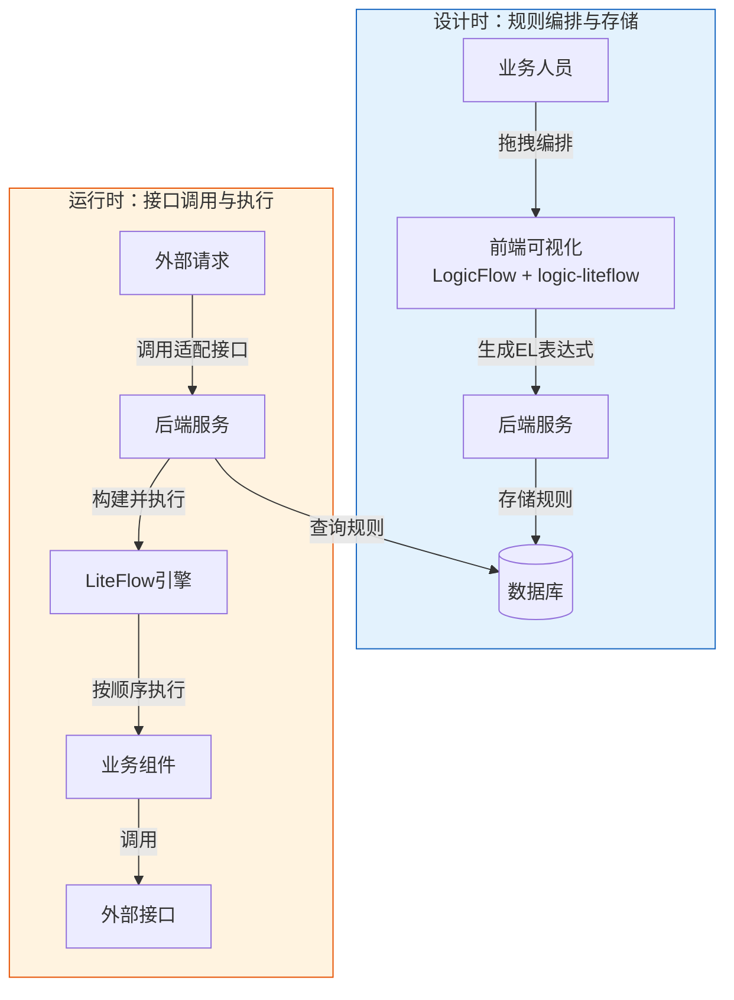
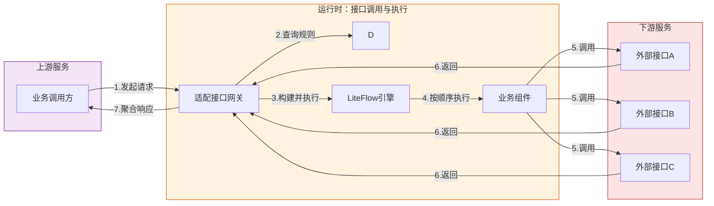
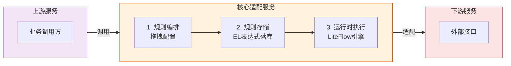
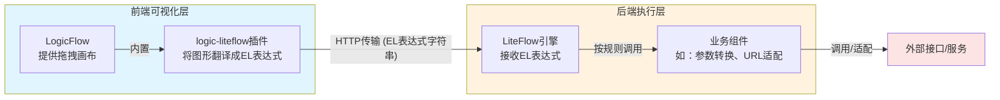
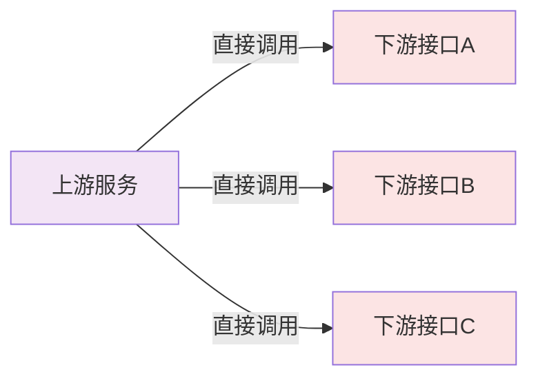
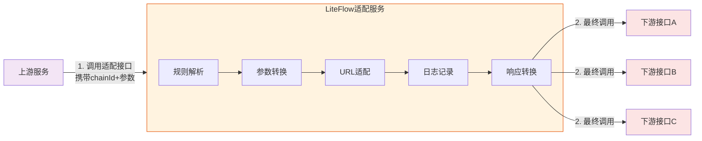

# 流编排

### LogicFlow

https://site.logic-flow.cn/

LogicFlow（前端流程图编辑框架） 是一款开源的流程可视化的前端框架，它的核心定位是帮助开发者快速搭建流程图编辑器，让业务人员可以通过拖拽、连线等可视化方式，来设计和配置业务流程。

### logic-liteflow

`logic-liteflow` 是一个专为 `LogicFlow` 开发的插件 。它的核心作用是将用户在 `LogicFlow` 画布上通过拖拽生成的图形数据，自动翻译成 `LiteFlow` 后端规则引擎能够直接识别的 EL表达式（规则字符串）

### LiteFlow

https://liteflow.cc/

LiteFlow 是一个开源的编排式规则引擎，它采用“组件化”和“规则化”的设计理念 ，实现配置化的组件编排和执行


















1、前端发送给后端的数据结构

```json
{
  "chainId": "order_query_adapter",
  "chainName": "订单查询适配流程",
  "version": 1,
  "graphData": {  // LogicFlow 的标准画布数据
    "nodes": [
      {
        "id": "node_1",
        "type": "paramConvert",  // 节点类型：参数转换
        "x": 100,
        "y": 100,
        "text": "参数转换",
        "properties": {  // ⭐ 关键：节点的自定义配置
          "nodeId": "paramConvert",
          "nodeName": "参数转换",
          "config": {
            // 参数转换组件的专属配置
            "mappings": [
              {
                "sourceField": "user.id",
                "targetField": "userId",
                "transform": "string"
              },
              {
                "sourceField": "user.name", 
                "targetField": "userName",
                "transform": "none"
              }
            ],
            "constants": [
              {
                "targetField": "source",
                "value": "ORDER_SERVICE"
              }
            ],
            "strategy": {
              "ignoreMissing": true
            }
          }
        }
      },
      {
        "id": "node_2",
        "type": "httpCaller",  // 节点类型：HTTP调用
        "x": 300,
        "y": 100,
        "text": "调用订单接口",
        "properties": {
          "nodeId": "httpCaller",
          "nodeName": "HTTP调用",
          "config": {  // HTTP组件的专属配置
            "url": "http://下游系统.com/order/get",
            "method": "POST",
            "timeout": 5000,
            "headers": {
              "Content-Type": "application/json",
              "appKey": "adapter_001"
            },
            "retry": {
              "count": 2,
              "interval": 1000
            }
          }
        }
      },
      {
        "id": "node_3",
        "type": "responseConvert",  // 节点类型：响应转换
        "x": 500,
        "y": 100,
        "text": "响应转换",
        "properties": {
          "nodeId": "responseConvert",
          "nodeName": "响应转换",
          "config": {  // 响应转换组件的专属配置
            "fieldMappings": {
              "data.orderId": "orderNo",
              "data.amount": "totalAmount"
            },
            "successCondition": "code == 0"
          }
        }
      }
    ],
    "edges": [
      {
        "id": "edge_1",
        "sourceNodeId": "node_1",
        "targetNodeId": "node_2",
        "properties": {}  // 连线也可以有自己的配置
      },
      {
        "id": "edge_2",
        "sourceNodeId": "node_2",
        "targetNodeId": "node_3",
        "properties": {}
      }
    ]
  }
}
```

画布保存代码逻辑

```js
// 保存整个流程图
async function saveFlow() {
  // 1. 获取画布数据（包含所有节点的properties）
  const graphData = lf.getGraphRawData();
  
  // 2. 生成EL表达式
  const elExpression = parse(graphData);
  
  // 3. 构建保存数据
  const saveData = {
    chainId: 'order_query_adapter',
    chainName: '订单查询适配流程',
    el: elExpression,
    graphData: graphData,  // ⭐ 包含每个节点的配置信息
    version: 1
  };
  
  // 4. 发送到后端
  const response = await fetch('/api/flow/save', {
    method: 'POST',
    headers: { 'Content-Type': 'application/json' },
    body: JSON.stringify(saveData)
  });
  
  const result = await response.json();
  console.log('保存成功', result);
}
```

 数据库设计

```java
-- 规则链表（完整存储画布数据）
CREATE TABLE flow_chain (
    id bigint PRIMARY KEY AUTO_INCREMENT,
    chain_id varchar(100) NOT NULL COMMENT '规则链ID',
    chain_name varchar(200) COMMENT '规则名称',
    el_expression text NOT NULL COMMENT 'EL表达式',
    graph_data json NOT NULL COMMENT '完整画布数据（包含所有节点配置）',
    -- graph_data字段示例：
    -- {
    --   "nodes": [
    --     {
    --       "id": "node_1",
    --       "type": "paramConvert",
    --       "properties": {
    --         "config": {
    --           "mappings": [...],
    --           "constants": [...]
    --         }
    --       }
    --     }
    --   ],
    --   "edges": [...]
    -- }
    
    version int DEFAULT 1,
    status tinyint DEFAULT 1,
    created_time datetime DEFAULT CURRENT_TIMESTAMP,
    updated_time datetime DEFAULT CURRENT_TIMESTAMP ON UPDATE CURRENT_TIMESTAMP,
    UNIQUE KEY uk_chain_id (chain_id)
) COMMENT='规则链表';

-- 可选：组件配置明细表（如果需要对组件配置单独查询）
CREATE TABLE flow_component_config (
    id bigint PRIMARY KEY AUTO_INCREMENT,
    chain_id varchar(100) NOT NULL,
    node_id varchar(100) NOT NULL,
    node_type varchar(50) NOT NULL,
    config_json json NOT NULL COMMENT '组件配置（从graph_data中提取）',
    created_time datetime DEFAULT CURRENT_TIMESTAMP,
    updated_time datetime DEFAULT CURRENT_TIMESTAMP ON UPDATE CURRENT_TIMESTAMP,
    KEY idx_chain_id (chain_id)
) COMMENT='组件配置明细表';
```

### 2. 后端接收和存储

```java
// ==================== Controller ====================
@RestController
@RequestMapping("/api/flow")
public class FlowController {
    
    @Autowired
    private FlowChainService flowChainService;
    
    @PostMapping("/save")
    public Result saveFlow(@RequestBody FlowSaveRequest request) {
        // request包含：chainId, chainName, el, graphData, version
        flowChainService.saveFlow(request);
        return Result.success();
    }
    
    @GetMapping("/load/{chainId}")
    public Result<FlowChain> loadFlow(@PathVariable String chainId) {
        FlowChain flowChain = flowChainService.loadFlow(chainId);
        return Result.success(flowChain);
    }
}

// ==================== Service ====================
@Service
public class FlowChainService {
    
    @Autowired
    private FlowChainMapper flowChainMapper;
    
    @Autowired
    private FlowComponentConfigMapper componentConfigMapper;
    
    @Transactional
    public void saveFlow(FlowSaveRequest request) {
        // 1. 保存规则链（包含完整graph_data）
        FlowChain chain = new FlowChain();
        chain.setChainId(request.getChainId());
        chain.setChainName(request.getChainName());
        chain.setElExpression(request.getEl());
        chain.setGraphData(request.getGraphData()); // 完整画布数据存为JSON
        chain.setVersion(request.getVersion());
        
        flowChainMapper.insertOrUpdate(chain);
        
        // 2. 可选：提取组件配置到明细表（便于查询）
        saveComponentConfigs(request.getChainId(), request.getGraphData());
    }
    
    /**
     * 从graph_data中提取每个节点的配置，存入明细表
     */
    private void saveComponentConfigs(String chainId, JsonNode graphData) {
        // 删除旧配置
        componentConfigMapper.deleteByChainId(chainId);
        
        // 提取节点配置
        JsonNode nodes = graphData.get("nodes");
        if (nodes != null && nodes.isArray()) {
            for (JsonNode node : nodes) {
                FlowComponentConfig config = new FlowComponentConfig();
                config.setChainId(chainId);
                config.setNodeId(node.get("id").asText());
                config.setNodeType(node.get("type").asText());
                config.setConfigJson(node.get("properties")); // 存储properties
                
                componentConfigMapper.insert(config);
            }
        }
    }
    
    /**
     * 加载规则（供运行时使用）
     */
    public FlowChain loadFlow(String chainId) {
        FlowChain chain = flowChainMapper.selectByChainId(chainId);
        
        // 如果需要，可以从明细表加载组件配置
        List<FlowComponentConfig> components = 
            componentConfigMapper.selectByChainId(chainId);
        
        // 可以将组件配置附加到chain对象中
        chain.setComponents(components);
        
        return chain;
    }
}

// ==================== 实体类 ====================
@Data
public class FlowChain {
    private Long id;
    private String chainId;
    private String chainName;
    private String elExpression;
    private JsonNode graphData;  // 完整画布数据
    private Integer version;
    private Integer status;
    
    // 非数据库字段：运行时需要的组件配置
    private transient List<FlowComponentConfig> components;
}

@Data
public class FlowComponentConfig {
    private Long id;
    private String chainId;
    private String nodeId;
    private String nodeType;
    private JsonNode configJson;  // 节点的properties
}
```

### 3. 运行时读取组件配置

```JAVA
// ==================== 运行时服务 ====================
@Service
public class RuntimeExecuteService {
    
    @Autowired
    private FlowChainMapper flowChainMapper;
    
    /**
     * 执行规则链
     */
    public ResponseData execute(String chainId, RequestData request) {
        // 1. 加载规则
        FlowChain chain = flowChainMapper.selectByChainId(chainId);
        
        // 2. 提取节点配置映射（nodeId -> config）
        Map<String, JsonNode> nodeConfigs = extractNodeConfigs(chain.getGraphData());
        
        // 3. 创建上下文，并传入节点配置
        AdapterContext context = new AdapterContext();
        context.setRequestParams(request);
        context.setNodeConfigs(nodeConfigs); // 所有节点的配置
        
        // 4. 执行LiteFlow
        LiteflowResponse response = flowExecutor.execute2Resp(
            chainId,  // 直接用chainId执行（规则已在启动时加载）
            context
        );
        
        return response.getContextBean(AdapterContext.class).getResponse();
    }
    
    /**
     * 从graph_data中提取节点配置
     */
    private Map<String, JsonNode> extractNodeConfigs(JsonNode graphData) {
        Map<String, JsonNode> configs = new HashMap<>();
        
        JsonNode nodes = graphData.get("nodes");
        if (nodes != null && nodes.isArray()) {
            for (JsonNode node : nodes) {
                String nodeId = node.get("properties").get("nodeId").asText();
                JsonNode config = node.get("properties").get("config");
                configs.put(nodeId, config);
            }
        }
        
        return configs;
    }
}

// ==================== 上下文 ====================
@Data
public class AdapterContext {
    private RequestData requestParams;      // 原始请求
    private Map<String, JsonNode> nodeConfigs;  // 所有节点的配置
    
    private Map<String, Object> convertedParams;  // 参数转换结果
    private String rawResponse;              // HTTP原始响应
    private ResponseData response;           // 最终响应
    
    /**
     * 获取指定节点的配置
     */
    public JsonNode getNodeConfig(String nodeId) {
        return nodeConfigs.get(nodeId);
    }
}
```

### 4. 组件中读取自己的配置

```JAVA
// ==================== 参数转换组件 ====================
@Component("paramConvert")
public class ParamConvertCmp extends NodeComponent {
    
    @Override
    public void process() {
        // 1. 获取上下文
        AdapterContext context = this.getContextBean(AdapterContext.class);
        
        // 2. 获取当前节点的配置（通过节点ID）
        // 当前节点ID可以从LiteFlow的NodeComponent中获取
        String nodeId = this.getNodeId();  // 对应前端properties.nodeId
        JsonNode config = context.getNodeConfig(nodeId);
        
        // 3. 解析配置
        JsonNode mappings = config.get("mappings");
        JsonNode constants = config.get("constants");
        
        // 4. 执行参数转换
        Map<String, Object> result = new HashMap<>();
        
        // 处理字段映射
        if (mappings != null && mappings.isArray()) {
            for (JsonNode mapping : mappings) {
                String sourceField = mapping.get("sourceField").asText();
                String targetField = mapping.get("targetField").asText();
                String transform = mapping.get("transform").asText();
                
                Object value = extractValue(context.getRequestParams(), sourceField);
                value = transformValue(value, transform);
                result.put(targetField, value);
            }
        }
        
        // 处理常量
        if (constants != null && constants.isArray()) {
            for (JsonNode constant : constants) {
                result.put(
                    constant.get("targetField").asText(),
                    constant.get("value").asText()
                );
            }
        }
        
        // 5. 存入上下文
        context.setConvertedParams(result);
    }
}

// ==================== HTTP调用组件 ====================
@Component("httpCaller")
public class HttpCallerCmp extends NodeComponent {
    
    @Override
    public void process() {
        AdapterContext context = this.getContextBean(AdapterContext.class);
        
        // 获取当前节点的配置
        String nodeId = this.getNodeId();
        JsonNode config = context.getNodeConfig(nodeId);
        
        // 读取HTTP配置
        String url = config.get("url").asText();
        String method = config.get("method").asText();
        int timeout = config.get("timeout").asInt();
        
        // 使用参数转换后的结果
        Map<String, Object> params = context.getConvertedParams();
        
        // 发起HTTP请求
        String response = HttpClient.request(url)
            .method(method)
            .timeout(timeout)
            .body(params)
            .execute();
        
        context.setRawResponse(response);
    }
}
```

